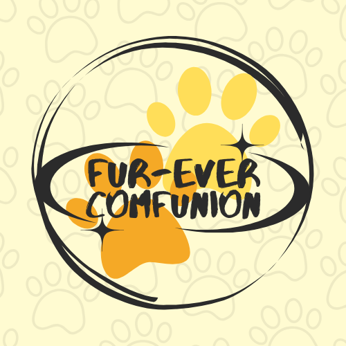
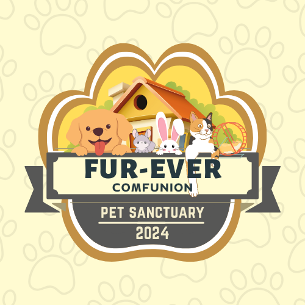

# Furever ComFUNion

 

---

## Overview

"Furever ComFUNion" is a generic database system designed to streamline the adoption and rehoming process for animals with fur and paws. Our system offers a range of features including:

- Adoption/rehoming tracking
- Applicant management
- Animal registration

The database maintains comprehensive profiles for adoptable animals, detailing their species, breed, age, and any special needs. It also tracks the status of prospective adopters' appointments and transactions. Additionally, the system allows clients to schedule appointments for adoptions or rehoming, subject to veterinarian approval. In summary, "Furever ComFUNion" serves as a centralized platform connecting animals in need of homes with loving adopters, ensuring a smooth and efficient adoption and rehoming process for all parties involved.

---

## Business Rules

- Each application requires a Veterinarian to manage it.
- One pet per application only.
- Veterinarian's services are not strictly exclusive to a single application.
- Clients can adopt and rehome, vice versa.

---

## Documentation

### Soft Copy of Manual Form

[Link to the manual form](https://www.canva.com/design/DAGA3tMefPE/aPt8C8q2vcuKwzEjf5fw0A/edit?utm_content=DAGA3tMefPE&utm_campaign=designshare&utm_medium=link2&utm_source=sharebutton)

*Disclaimer: The form has been revised specifically for this project to simplify inputs and is not the official form used by the FAUGET Animal Shelter.*

### Normalization

[Link to the normalization documentation](https://docs.google.com/spreadsheets/d/1qQ6mgWr-jic6zWBTz1Zve5SQPBW1k35RfxIZBazvzHs/edit?usp=sharing)

### Entity-Relationship Diagram (ERD)

[Link to the ERD](https://lucid.app/lucidchart/8576b084-1302-4b38-a30f-6d9d078c8a4f/edit?viewport_loc=-5332%2C339%2C3840%2C1695%2C0_0&invitationId=inv_9335e154-3ccf-411f-939c-24920c16ccc0)

### Data Dictionary

[Link to the Data Dictionary](https://docs.google.com/spreadsheets/d/1VVqiiR2KJIW1gC9mhwUaOY1MfFndEEd2-GYizXBWOpQ/edit?usp=sharing)

---

## Technology Stack

To implement the "Furever ComFUNion" system, we have chosen the following technologies:

- **NetBeans IDE 8.2**: An integrated development environment used for developing with Java, particularly helpful for managing large projects with its extensive set of tools and plugins.
- **Java Swing**: A GUI widget toolkit for Java, which provides a robust set of components for building graphical user interfaces.
- **MySQL**: A widely-used relational database management system that offers reliability, performance, and ease of use, ideal for managing the comprehensive profiles and data required by our system.

---

## Authors

This project was created by the following students from the Faculty of the College of Computer and Information Sciences, Polytechnic University of the Philippines, Sta. Mesa, Manila, in partial fulfillment of the course COMP 010 – Information Management:

- Caldejon, Christian Angelo C.
- Fernandez, Cassidy L.
- Lafuente, Rafael P.
- Macatunao, Joshua C.

**BSIT 2-3**

**April, 2024**

## Contribute

We welcome contributions from developers and animal enthusiasts alike! If you have ideas for new features, improvements, or find any issues, feel free to contribute to this project. You can find the source code, report bugs, and submit pull requests directly in this Github repository.

---

  
